#  Comandos para levantar el proyecto

1. `py -3.10 -m venv venv`
2. `venv\Scripts\activate`
3. `pip install setuptools wheel`
4. `pip install -r requirements.txt`
5. `python odoo-bin -r odoo -w odoo --addons-path=addons,modules -d odoo17`

---

#  Credenciales para iniciar sesión en Odoo

- **Usuario:** `admin`  
- **Contraseña:** `admin`

---

#  Base de datos

- **Nombre:** `odoo17`

##  Roles de base de datos

- **Usuario:** `odoo`  
- **Contraseña:** `odoo`

---

#  Navegación en el panel

En el panel lateral izquierdo se encuentran los módulos:

- **Alumnos**
- **Programa**
- **Inscripción**

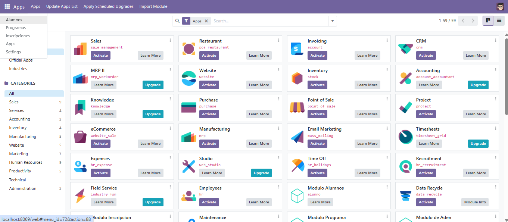

---

##  Módulo: Alumnos

###  Listado de alumnos  
Se pueden ver y eliminar alumnos existentes.

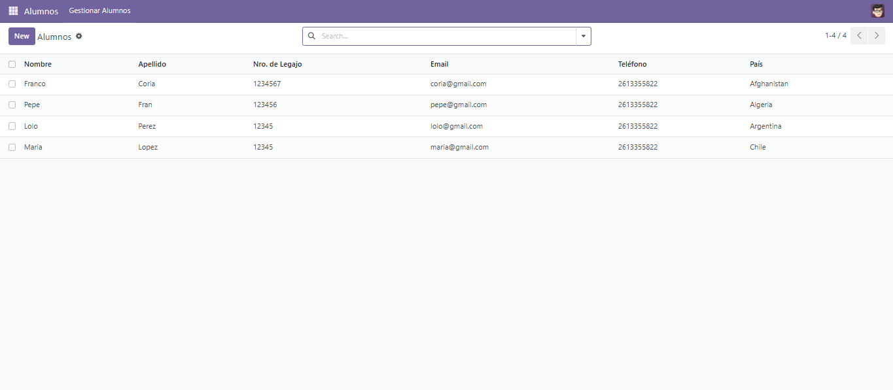

###  Agregar alumno

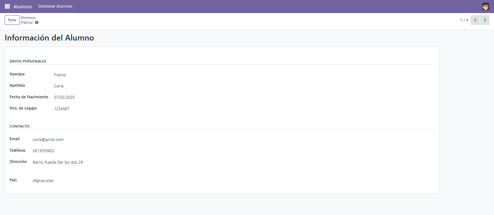

###  Editar alumno

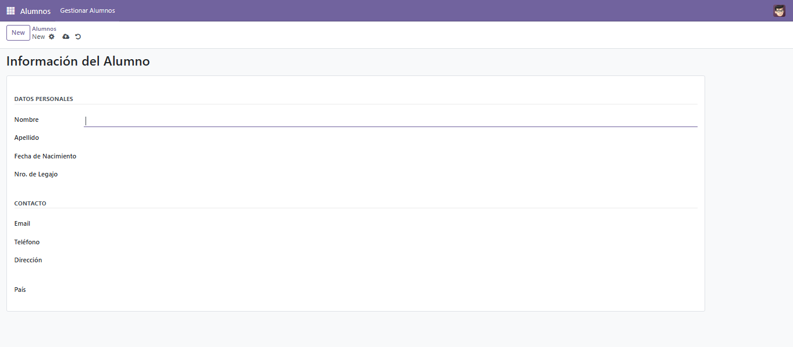

---

##  Módulo: Programas

###  Listado de programas  
Permite ver y eliminar programas existentes.

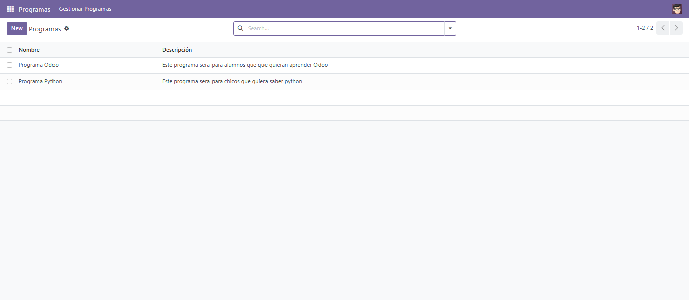

###  Agregar programa

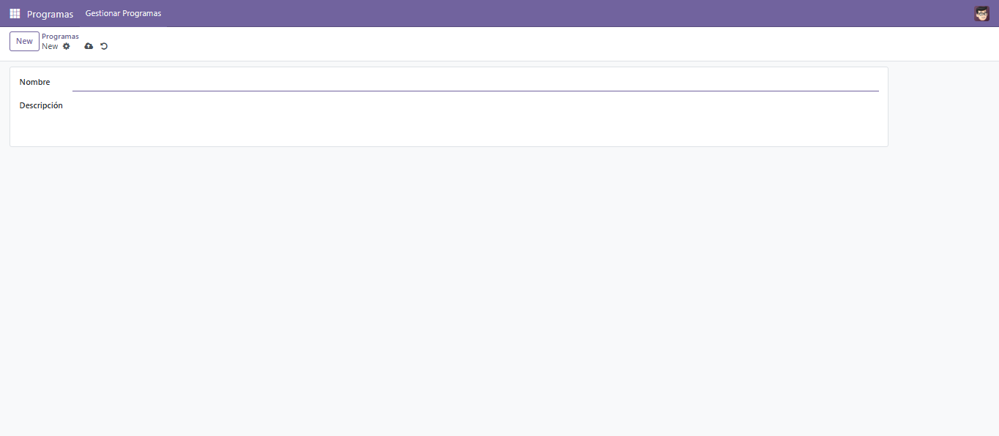

###  Editar programa

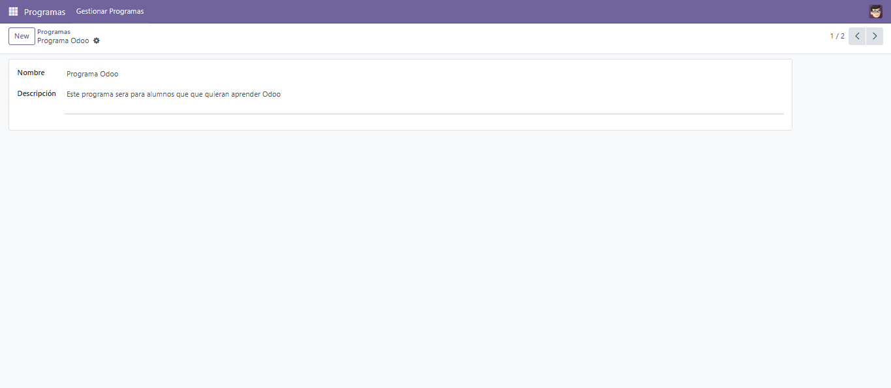

---

##  Módulo: Inscripciones

###  Listado de inscripciones  
Permite ver y eliminar inscripciones.

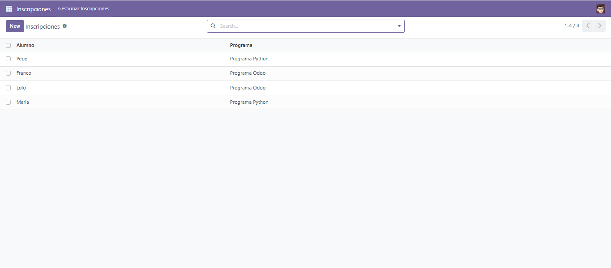

###  Agregar inscripción

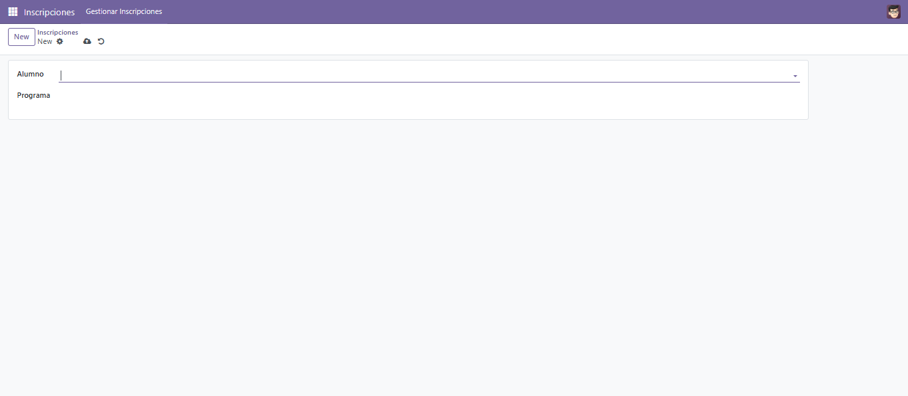

###  Editar inscripción

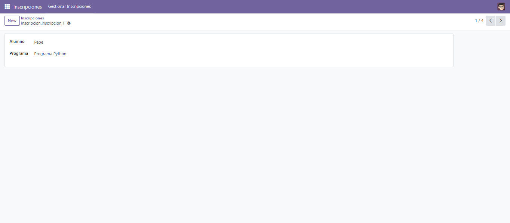

---

##  Endpoint API - Método GET

Se puede consultar la lista de alumnos inscritos a un programa específico usando su `id`.

###  Ejemplo: Programa ID = 1 (Programa Odoo)

**URL:**  
`http://localhost:8069/api/programa/1/alumnos`

**Resultado JSON:**

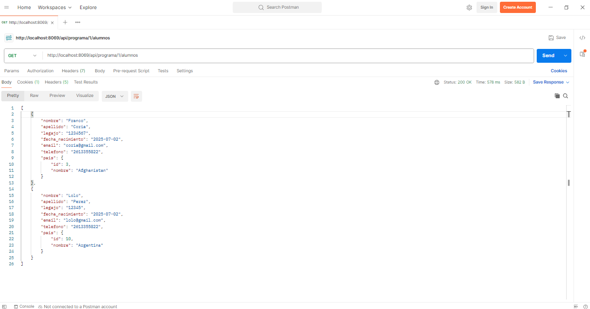

---

###  Ejemplo: Programa ID = 2 (Programa Python)

**URL:**  
`http://localhost:8069/api/programa/2/alumnos`

**Resultado JSON:**

